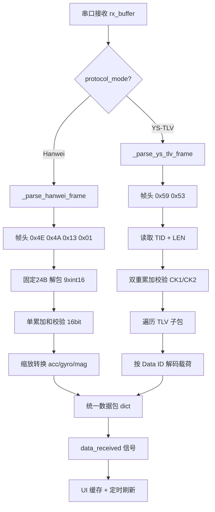

# TLV 串口协议扩展方案

> **版本**: v1.0  
> **日期**: 2026-06-10  
> **目标**: 在保留现有 Hanwei 协议的基础上，新增 YS-TLV 协议支持，通过 UI 可切换

---

## 1. 协议对比

| 特性 | 现有协议 (Hanwei) | 新增协议 (YS-TLV) |
|------|-------------------|-------------------|
| 帧头 | `0x4E 0x4A 0x13 0x01` (4B) | `0x59 0x53` (2B) |
| 帧长 | 固定 24 字节 | 变长 (5+LEN+2) |
| 数据格式 | 9×int16 连续存储 | TLV 子包序列 |
| 数据内容 | acc/gyro/mag | 温度/acc/gyro/磁场归一化/磁场强度/欧拉角/四元数 |
| 校验和 | 单累加和 16bit | 双累加和 CK1+CK2 各 8bit |
| 字节序 | 小端 | 小端 |

## 2. YS-TLV 协议帧结构

```
偏移:  0    1    2    3    4    5 ... 5+LEN-1  5+LEN  5+LEN+1
内容: 0x59 0x53  TID_L TID_H  LEN  TLV序列...  CK1    CK2
```

校验范围: TID(偏移2) 到 MESSAGE结束(偏移 4+LEN)，含 LEN 字节

### TLV 子包格式

每个子包: `[Data_ID(1B)] [Payload(变长)]`

| Data ID | 载荷长度 | 内容 | 单位 | 字段数 |
|---------|----------|------|------|--------|
| 0x01 | 2 | 温度 | 0.01 °C | 1×int16 |
| 0x10 | 12 | 加速度 X/Y/Z | 1e-6 m/s² | 3×int32 |
| 0x20 | 12 | 角速度 X/Y/Z | 1e-6 deg/s | 3×int32 |
| 0x30 | 12 | 磁场归一化 X/Y/Z | 1e-6 | 3×int32 |
| 0x31 | 12 | 磁场强度 X/Y/Z | 0.001 mGauss | 3×int32 |
| 0x40 | 12 | 欧拉角 Pitch/Roll/Yaw | 1e-6 deg | 3×int32 |
| 0x41 | 16 | 四元数 q0/q1/q2/q3 | 1e-6 | 4×int32 |

### 校验和算法

```python
# 累加范围: byte[2] ~ byte[4+LEN] (TID 到 MESSAGE 结束含 LEN)
ck1_running = 0
ck2_running = 0
for i in range(2, 5 + len):  # 偏移2 到 偏移4+LEN
    ck1_running = (ck1_running + byte[i]) & 0xFF
    ck2_running = (ck2_running + ck1_running) & 0xFF
CK1 = ck1_running
CK2 = ck2_running
```

## 3. 数据流架构



## 4. 模块修改详情

### 4.1 `core/serial_thread.py` — 核心变更

#### 4.1.1 新增属性

```python
# IMUSerialThread.__init__() 中添加:
self.protocol_mode = "Hanwei"  # "Hanwei" 或 "YS-TLV"
```

#### 4.1.2 新增 TLV 解码常量表

```python
# 模块级常量
YS_TLV_HEADER = bytes([0x59, 0x53])

# Data ID -> (载荷字节数, 字段数, 解码格式, 缩放因子, 输出键名)
YS_TLV_DATA_IDS = {
    0x01: (2,  1, '<h',  0.01,       'temperature'),   # 温度 int16
    0x10: (12, 3, '<3i', 1e-6,       'acc'),            # 加速度 3xint32
    0x20: (12, 3, '<3i', 1e-6,       'gyro'),           # 角速度 3xint32
    0x30: (12, 3, '<3i', 1e-6,       'mag_normalized'), # 磁场归一化 3xint32
    0x31: (12, 3, '<3i', 0.001,      'mag'),            # 磁场强度 3xint32
    0x40: (12, 3, '<3i', 1e-6,       'euler_raw'),      # 欧拉角 3xint32 (P/R/Y)
    0x41: (16, 4, '<4i', 1e-6,       'quaternion'),     # 四元数 4xint32
}
```

#### 4.1.3 新增 `_verify_ys_tlv_checksum()` 方法

```python
def _verify_ys_tlv_checksum(self, frame, msg_len):
    """验证 YS-TLV 帧的双重累加校验和
    
    Args:
        frame: 完整帧字节 (含帧头到CK2)
        msg_len: LEN 字段值
    
    Returns:
        bool: 校验是否通过
    """
    # 校验范围: 偏移2 (TID) 到 偏移 4+LEN (MESSAGE末尾含LEN字节)
    ck1_calc = 0
    ck2_calc = 0
    for i in range(2, 5 + msg_len):  # 偏移2 到 偏移4+LEN
        ck1_calc = (ck1_calc + frame[i]) & 0xFF
        ck2_calc = (ck2_calc + ck1_calc) & 0xFF
    
    ck1_recv = frame[5 + msg_len]
    ck2_recv = frame[5 + msg_len + 1]
    return ck1_calc == ck1_recv and ck2_calc == ck2_recv
```

#### 4.1.4 新增 `_parse_ys_tlv_tlvs()` 方法

```python
def _parse_ys_tlv_tlvs(self, payload):
    """解析 YS-TLV 帧中的 TLV 子包序列
    
    Args:
        payload: LEN 字节的 TLV 子包数据
    
    Returns:
        dict: 解析后的各传感器数据
    """
    result = {}
    offset = 0
    while offset < len(payload):
        data_id = payload[offset]
        offset += 1
        
        if data_id not in YS_TLV_DATA_IDS:
            break  # 未知 ID，停止解析
        
        payload_len, field_count, fmt, scale, key = YS_TLV_DATA_IDS[data_id]
        
        if offset + payload_len > len(payload):
            break  # 数据不足，停止解析
        
        raw_values = struct.unpack(fmt, payload[offset:offset + payload_len])
        offset += payload_len
        
        if field_count == 1:
            result[key] = raw_values[0] * scale
        else:
            result[key] = [v * scale for v in raw_values]
    
    return result
```

#### 4.1.5 新增 `_process_ys_tlv_packet()` 方法

将 TLV 解析结果统一转换为现有数据包格式:

```python
def _process_ys_tlv_packet(self, tlv_data):
    """将 YS-TLV 解析结果转换为统一的 processed_packet 格式
    
    关键转换:
    - acc: 1e-6 m/s² → m/s² (直接使用)
    - gyro: 1e-6 deg/s → deg/s → rad/s (用于融合算法) + deg/s (用于输出)
    - mag: 0.001 mGauss → mGauss (直接使用)
    - euler_raw: 若存在, 直接使用 Pitch/Roll/Yaw (跳过融合算法)
    - quaternion: 若存在, 转换为欧拉角 (备用)
    - temperature: 附加到数据包
    
    Returns:
        dict: {'acc': [...], 'gyro': [...], 'mag': [...], 'euler': [...], ...}
    """
    processed = {
        'acc': [0.0, 0.0, 0.0],
        'gyro': [0.0, 0.0, 0.0],
        'mag': [0.0, 0.0, 0.0],
        'euler': [0.0, 0.0, 0.0],  # [roll, pitch, yaw]
    }
    
    # 加速度
    if 'acc' in tlv_data:
        processed['acc'] = tlv_data['acc']
    
    # 角速度: TLV协议给出 deg/s, 需转换为 rad/s 进行融合
    gyro_rads = [0.0, 0.0, 0.0]
    if 'gyro' in tlv_data:
        gyro_deg = tlv_data['gyro']  # [gx, gy, gz] in deg/s
        processed['gyro'] = gyro_deg
        gyro_rads = [np.radians(g) for g in gyro_deg]
    
    # 磁场强度 (优先使用 0x31, 回退到 0x30)
    if 'mag' in tlv_data:
        processed['mag'] = tlv_data['mag']
    elif 'mag_normalized' in tlv_data:
        # 归一化磁场无法直接转换为 mGauss, 仅作方向参考
        processed['mag'] = tlv_data['mag_normalized']
    
    # 温度 (可选附加)
    if 'temperature' in tlv_data:
        processed['temperature'] = tlv_data['temperature']
    
    # 四元数 (可选附加)
    if 'quaternion' in tlv_data:
        processed['quaternion'] = tlv_data['quaternion']
    
    # 欧拉角处理策略:
    # - 若 TLV 包含 0x40 (euler_raw), 直接使用 (设备端已融合)
    # - 否则使用本地融合算法
    if 'euler_raw' in tlv_data:
        # TLV 欧拉角顺序: Pitch/Roll/Yaw → 输出顺序: Roll/Pitch/Yaw
        pitch, roll, yaw = tlv_data['euler_raw']
        processed['euler'] = [roll, pitch, yaw]
    else:
        # 使用本地 Mahony/Madgwick/EKF 融合
        ax, ay, az = processed['acc']
        gx, gy, gz = gyro_rads
        mx, my, mz = processed['mag']
        
        now = time.time()
        dt = now - self.last_time
        self.last_time = now
        if dt <= 0 or dt > 0.1:
            dt = 0.005
        
        if self.algo_mode != "Raw Data Only":
            self.fusion_engine.update_9dof(ax, ay, az, gx, gy, gz, mx, my, mz, dt)
            roll, pitch, yaw = self.fusion_engine.get_euler()
            processed['euler'] = [roll, pitch, yaw]
    
    return processed
```

#### 4.1.6 修改 `run()` 方法

在 [`run()`](core/serial_thread.py:90) 方法中，根据 `self.protocol_mode` 分发到不同的解析逻辑:

```python
def run(self):
    rx_buffer = bytearray()
    
    while self.running:
        if self.serial_port and self.serial_port.in_waiting > 0:
            new_data = self.serial_port.read(self.serial_port.in_waiting)
            rx_buffer.extend(new_data)
            
            if self.protocol_mode == "Hanwei":
                self._process_hanwei_buffer(rx_buffer)
            else:
                self._process_ys_tlv_buffer(rx_buffer)
        else:
            time.sleep(0.001)
```

#### 4.1.7 新增 `_process_hanwei_buffer()` 方法

将现有 [`run()`](core/serial_thread.py:90) 中的 Hanwei 协议解析逻辑原封不动提取:

```python
def _process_hanwei_buffer(self, rx_buffer):
    """原有 Hanwei 固定帧协议解析 (24字节)"""
    FRAME_LEN = 24
    while len(rx_buffer) >= FRAME_LEN:
        if rx_buffer[0] == 0x4E and rx_buffer[1] == 0x4A and rx_buffer[2] == 0x13 and rx_buffer[3] == 0x01:
            frame = rx_buffer[:FRAME_LEN]
            calc_sum = sum(frame[:22]) & 0xFFFF
            pack_sum = struct.unpack('<H', frame[22:24])[0]
            
            if calc_sum == pack_sum:
                raw_data = struct.unpack('<9h', frame[4:22])
                self.packet_count += 1
                
                ax = raw_data[0] * self.ACC_SCALE
                ay = raw_data[1] * self.ACC_SCALE
                az = raw_data[2] * self.ACC_SCALE
                gx = np.radians(raw_data[3] * self.GYRO_SCALE)
                gy = np.radians(raw_data[4] * self.GYRO_SCALE)
                gz = np.radians(raw_data[5] * self.GYRO_SCALE)
                mx = raw_data[6] / self.MAG_SCALE
                my = raw_data[7] / self.MAG_SCALE
                mz = raw_data[8] / self.MAG_SCALE
                
                # ... (后续 fusion + 录制 + emit 逻辑保持不变)
                del rx_buffer[:FRAME_LEN]
            else:
                self.drop_count += 1
                del rx_buffer[0]
        else:
            del rx_buffer[0]
```

#### 4.1.8 新增 `_process_ys_tlv_buffer()` 方法

```python
def _process_ys_tlv_buffer(self, rx_buffer):
    """YS-TLV 变长帧协议解析"""
    while len(rx_buffer) >= 7:  # 最小帧: 帧头2 + TID2 + LEN1 + CK1 + CK2 = 7 (LEN=0)
        # 查找帧头
        if rx_buffer[0] != 0x59 or rx_buffer[1] != 0x53:
            del rx_buffer[0]
            continue
        
        if len(rx_buffer) < 5:
            break  # 数据不足, 等待更多数据
        
        msg_len = rx_buffer[4]
        total_frame_len = 5 + msg_len + 2  # 头5B + MESSAGE + CK1 + CK2
        
        if len(rx_buffer) < total_frame_len:
            break  # 数据不足, 等待更多数据
        
        frame = bytes(rx_buffer[:total_frame_len])
        
        # 校验
        if self._verify_ys_tlv_checksum(frame, msg_len):
            self.packet_count += 1
            
            # 解析 TLV 子包
            tlv_payload = frame[5:5 + msg_len]
            tlv_data = self._parse_ys_tlv_tlvs(tlv_payload)
            
            # 转换为统一数据包格式
            processed_packet = self._process_ys_tlv_packet(tlv_data)
            
            # 构造原始字符串显示
            raw_data_str = str(processed_packet)
            self.raw_string_received.emit(raw_data_str)
            
            # 录制
            if self.is_recording and self.record_file:
                row_data = [
                    f"{time.time():.4f}",
                    f"{processed_packet['acc'][0]:.4f}", f"{processed_packet['acc'][1]:.4f}", f"{processed_packet['acc'][2]:.4f}",
                    f"{processed_packet['gyro'][0]:.2f}", f"{processed_packet['gyro'][1]:.2f}", f"{processed_packet['gyro'][2]:.2f}",
                    f"{processed_packet['mag'][0]:.1f}", f"{processed_packet['mag'][1]:.1f}", f"{processed_packet['mag'][2]:.1f}",
                    f"{processed_packet['euler'][0]:.2f}", f"{processed_packet['euler'][1]:.2f}", f"{processed_packet['euler'][2]:.2f}"
                ]
                try:
                    if self.record_format == "csv":
                        self.record_writer.writerow(row_data)
                    else:
                        self.record_file.write("\t".join(row_data) + "\n")
                except Exception:
                    pass
            
            # 发射信号
            self.data_received.emit(processed_packet)
            del rx_buffer[:total_frame_len]
        else:
            self.drop_count += 1
            del rx_buffer[:2]  # 跳过帧头, 重新搜索
```

### 4.2 `ui/main_window.py` — UI 变更

在 "Port & Baud Rate" 分组 (`port_box`) 内新增协议选择下拉框:

```python
# 在 port_grid 中添加一行
self.port_grid.addWidget(QtWidgets.QLabel("Protocol"), 2, 0)
self.cb_protocol = QtWidgets.QComboBox()
self.cb_protocol.addItems(["Hanwei", "YS-TLV"])
self.cb_protocol.setCurrentText("Hanwei")
self.port_grid.addWidget(self.cb_protocol, 2, 1)
```

UI 效果: 在 Baud Rate 下方新增 "Protocol" 下拉框，默认 "Hanwei"。

### 4.3 `main.py` — 信号绑定变更

在 [`IMUViewer.__init__()`](main.py:16) 中添加协议切换信号绑定:

```python
# 绑定协议切换
self.ui.cb_protocol.currentTextChanged.connect(self.change_protocol)
```

新增方法:

```python
def change_protocol(self, protocol_name):
    """切换串口通讯协议"""
    self.serial_thread.protocol_mode = protocol_name
    self.show_status_message(f"协议已切换为: {protocol_name}")
```

### 4.4 录制格式扩展 (可选)

若需要录制温度和四元数数据，可在 YS-TLV 模式下扩展 CSV headers:

```python
# YS-TLV 模式下的扩展 headers
headers_tlv = ['Timestamp', 'AccX', 'AccY', 'AccZ',
               'GyroX', 'GyroY', 'GyroZ', 'MagX', 'MagY', 'MagZ',
               'Roll', 'Pitch', 'Yaw', 'Temperature',
               'Q0', 'Q1', 'Q2', 'Q3']
```

此为可选优化项，初始版本可先保持与 Hanwei 相同的录制列，温度和四元数暂不录制。

## 5. 文件修改清单

| 文件 | 修改类型 | 修改内容 |
|------|----------|----------|
| [`core/serial_thread.py`](core/serial_thread.py) | 重构+新增 | 添加 `protocol_mode` 属性; 提取 `_process_hanwei_buffer()`; 新增 `_verify_ys_tlv_checksum()`, `_parse_ys_tlv_tlvs()`, `_process_ys_tlv_buffer()`, `_process_ys_tlv_packet()`; 修改 `run()` 方法 |
| [`ui/main_window.py`](ui/main_window.py) | 新增 | 在 `port_box` 中添加 `cb_protocol` ComboBox |
| [`main.py`](main.py) | 新增 | 添加 `change_protocol()` 方法和信号绑定 |

## 6. 实施顺序

1. **`core/serial_thread.py`**: 先添加 TLV 相关常量和方法，再重构 `run()` 方法
2. **`ui/main_window.py`**: 添加协议下拉框 UI
3. **`main.py`**: 绑定信号槽，完成端到端功能
4. **测试验证**: 分别用两种协议连接设备验证功能

## 7. 风险与注意事项

- **线程安全**: `protocol_mode` 属性在 UI 线程设置、串口线程读取，需确保原子性。Python 的 GIL 保证了简单字符串赋值的原子性，无需额外锁
- **运行中切换**: 应仅允许在**未连接**状态下切换协议，或在切换时自动断开重连。建议在 UI 层限制: 连接状态下禁用协议下拉框
- **缓冲区残留**: 切换协议时如果 rx_buffer 中有残留数据，可能导致误解析。建议在连接时清空 rx_buffer (当前实现在 `connect_serial()` 中重新创建，已安全)
- **TLV 子包容错**: 若某个 Data ID 未知或载荷长度不足，应跳过该子包而非丢弃整帧。当前设计中 `_parse_ys_tlv_tlvs()` 遇到未知 ID 会 `break`，可考虑改为 `continue` 跳过 (需在子包中包含长度字段；但当前协议中子包没有独立的 Length 字段，只能查表获取长度，因此遇到未知 ID 无法跳过，`break` 是正确行为)
